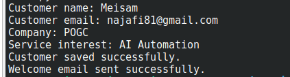
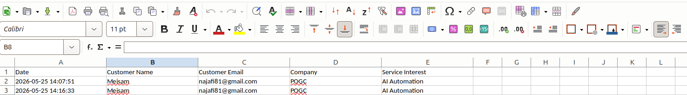
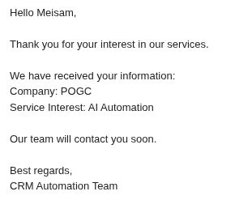

# CRM Automation with Python

A Python automation project that stores customer information in Excel and sends automatic welcome emails using SMTP.

---

## Features

- Collect customer information from terminal input
- Save customer data into Excel automatically
- Send automatic welcome emails
- Use environment variables for security
- SMTP email integration
- Error handling
- CRM workflow automation

---

## Technologies Used

- Python
- OpenPyXL
- SMTP
- python-dotenv
- Excel Automation
- Git
- GitHub

---

## Project Structure

```text
crm-automation/
├── data/
│   └── customers.xlsx
├── screenshots/
│   ├── program-run.png
│   ├── customers-excel.png
│   └── email-received.png
├── main.py
├── requirements.txt
├── README.md
├── .env
└── .gitignore
```

---

## Installation

Clone the repository:

```bash
git clone https://github.com/najafi81/crm-automation.git
```

Go to project directory:

```bash
cd crm-automation
```

Create virtual environment:

```bash
python3 -m venv venv
```

Activate virtual environment:

### Linux / macOS

```bash
source venv/bin/activate
```

Install dependencies:

```bash
pip install -r requirements.txt
```

---

## Environment Variables

Create a `.env` file:

```env
SMTP_SERVER=smtp.gmail.com
SMTP_PORT=587
EMAIL_ADDRESS=your_email@gmail.com
EMAIL_PASSWORD=your_app_password
```

---

## Gmail App Password Setup

To use Gmail SMTP securely:

1. Enable 2-Step Verification in your Google Account
2. Go to:

```text
Google Account → Security → App Passwords
```

3. Create a new App Password
4. Use the generated 16-character password inside `.env`

---

## Usage

Run the program:

```bash
python3 main.py
```

Example input:

```text
Customer name: Meisam
Customer email: najafi81@gmail.com
Company: POGC
Service interest: AI Automation
```

Successful output:

```text
Customer saved successfully.
Welcome email sent successfully.
```

---

## Generated Excel File

The program automatically creates:

```text
data/customers.xlsx
```

Stored columns:

| Date | Customer Name | Customer Email | Company | Service Interest |
|---|---|---|---|---|

---

## Screenshots

### Program Execution



### Excel Customer Database



### Received Welcome Email



---

## Security Notes

These files should NOT be uploaded to GitHub:

```text
.env
*.docx
venv/
__pycache__/
```

---

## Future Improvements

- Add customer search
- Add duplicate email detection
- Add email templates
- Use Google Sheets instead of Excel
- Add automatic follow-up emails
- Add CRM dashboard
- Connect to database

---

## Author

Meisam

GitHub:
https://github.com/najafi81
